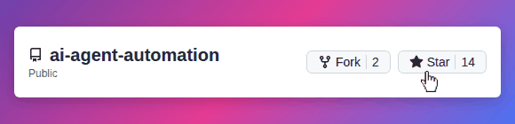

<h1 align="center">⚡ AI Agent Automation</h1>

<p align="center">
  <strong>Open-source, local-first workflow execution engine for AI agents</strong>
</p>

> [!TIP]
> ⭐ Starring this repo helps more developers discover **AI Agent Automation**
>
> 

---
## ⚙️ How It Works

1. You create a **Workflow** made of ordered steps (**LLM**, **HTTP**, **Tool**, **Delay**)
2. Running a workflow creates a **Task** (manual or scheduled)
3. An **Agent** executes each step **deterministically**
4. Every step produces:
   - input
   - output
   - success / failure

5. You inspect, debug, re-run, and automate with **full visibility**

---

## 🧠 What This Project Is

**AI Agent Automation Platform** is a **developer-first execution engine** for AI-driven workflows.

This is **not**:

- A prompt playground
- A chatbot UI demo
- A SaaS-locked automation tool

This **is**:

- A real workflow engine
- Deterministic, step-by-step execution
- Agent-driven automation
- Fully local & self-hosted

If you like tools such as **n8n**, **Zapier**, or **Temporal** — but want something **AI-native**, **local**, and **inspectable**, this project is for you.

---

## 👤 Who This Is For

✔ Developers building AI-driven automation
✔ Teams needing inspectable, debuggable execution
✔ Privacy-conscious & self-hosted setups

❌ Chatbot-only demos
❌ Prompt-only experiments
❌ No-code SaaS users

---

## ✨ Core Capabilities

### 🤖 Agent-Driven Execution

- Autonomous AI agents execute workflows
- Pluggable LLM support (OpenAI, Gemini, Groq, local models)
- Deterministic execution model
- Explicit inputs & outputs per step
- Step-level success / failure tracking

---

### 🔗 Workflow Automation

- Visual workflow builder
- Ordered, sequential steps
- Supported step types:
  - **LLM** — reasoning & generation
  - **HTTP** — API calls
  - **Tool** — internal actions
  - **Delay** — time-based control

Each workflow run becomes a **Task** with full traceability.

---

### ⏱ Scheduling (Cron Automation)

- Cron-based schedules
- Automatic task creation
- Ideal for:
  - Monitoring
  - Reports
  - Background automation
  - Periodic data sync

---

### 📊 Observability & Debugging

- Task execution timeline
- Step-level outputs & errors
- Real-time system logs
- Clear failure attribution
- Built for **root-cause analysis**, not guesswork

---

### 🧠 Agent Semantic Memory

- Persistent, agent-scoped semantic memory
- Embedding-based retrieval using cosine similarity
- Similarity threshold filtering to prevent noise
- Retention cap per agent
- Token-safe prompt injection
- Fully vendor-agnostic (no external vector DB required)

Enables agents to recall relevant past interactions across workflow executions.

---

## 🏗 High-Level Architecture (Simplified)

```
Frontend (Next.js)
      ↓
REST API (Express)
      ↓
Workflow Engine
  ├─ Agent Runner
  ├─ Step Executor
  ├─ Tool Registry
  ├─ Scheduler
  └─ Logger
      ↓
MongoDB (Workflows, Tasks, Agents, Logs)
```

## 🛠 Tech Stack

**Backend**

- Node.js + Express
- MongoDB
- Cron Scheduler
- Custom Agent Runtime

**Frontend**

- Next.js
- React
- Tailwind CSS

**AI & Automation**

- Pluggable LLM adapters
- Tool sandboxing
- Local-first execution

---

## 🧪 Common Use Cases

- AI workflow automation
- Scheduled backend jobs
- Monitoring & alerting agents
- Document processing pipelines
- Internal developer tools
- Secure AI experimentation

---

## 🔐 Security & Privacy

- Fully self-hosted
- No data leaves your system by default
- Secrets via environment variables only
- No vendor lock-in
- No hidden SaaS dependencies
- Memory stored locally in MongoDB
- No external vector database required

---

## 🚀 Local Development

### 1️⃣ Clone

```bash
git clone https://github.com/vmDeshpande/ai-agent-automation.git
cd ai-agent-automation
```

### 2️⃣ Backend

```bash
cd backend
npm install
cp .env.example .env
npm run dev
npm run worker
```

Backend → `http://localhost:5000`

### 3️⃣ Frontend

```bash
cd frontend
npm install
npm run dev
```

Frontend → `http://localhost:3000`

---

## 🐳 Docker Deployment

Run the entire platform (MongoDB, backend API, worker, and frontend) using Docker.

---

### Prerequisites

- Docker Desktop: [https://www.docker.com/products/docker-desktop/](https://www.docker.com/products/docker-desktop/)
- Docker Compose (included with Docker Desktop)

Verify installation:

```bash
docker --version
docker compose version
```

---

### 🚀 Quick Start

```bash
cd infra

# Copy environment configuration
cp .env.example .env

# Edit .env (at minimum set JWT_SECRET)
# Port overrides are optional; safe defaults are already provided

# Build and start all services
docker compose up --build
```

After startup open:

```
http://localhost:3000
```

If `3000`, `5000`, or `27017` are already in use on your machine, change `FRONTEND_PORT`, `BACKEND_PORT`, or `MONGO_PORT` in `infra/.env` before starting.

---

### 🧩 Services

| Service     | URL                                            | Description            |
| ----------- | ---------------------------------------------- | ---------------------- |
| Frontend    | [http://localhost:3000](http://localhost:3000) | Next.js web interface (default, configurable) |
| Backend API | [http://localhost:5000](http://localhost:5000) | Express API server (default, configurable) |
| MongoDB     | localhost:27017                                | Database (default, configurable) |
| Worker      | internal                                       | Executes workflow jobs |

Startup order:

```
MongoDB
↓
Mongo Replica Init
↓
Backend API
↓
Worker
↓
Frontend
```

MongoDB replica sets are initialized automatically during startup.

---

### ⚙ Configuration

Edit the environment file:

```
infra/.env
```

Example configuration:

```bash
MONGO_URI=mongodb://mongo:27017/ai-agent
JWT_SECRET=your-secure-random-string

# LLM Providers
GROQ_API_KEY=
OPENAI_API_KEY=
GEMINI_API_KEY=
HF_API_KEY=

# Optional local models
OLLAMA_HOST=http://host.docker.internal:11434

# Optional host port overrides (defaults shown)
MONGO_PORT=27017
BACKEND_PORT=5000
FRONTEND_PORT=3000
```

These port variables are optional. If you leave them unchanged, Docker Compose uses the default ports shown above. The frontend API URL is derived automatically from `BACKEND_PORT`.

You do not need to set `NEXT_PUBLIC_API_URL` in `infra/.env` for Docker deployments.

---

### 🛠 Common Commands

### Start services

```bash
docker compose up -d
```

### View logs

```bash
docker compose logs -f
```

### Stop services

```bash
docker compose down
```

### Rebuild after code changes

```bash
docker compose up --build
```

### Stop and remove containers + volumes

```bash
docker compose down -v
```

---

### Troubleshooting

If a default port is already in use:

```bash
# infra/.env
MONGO_PORT=27018
BACKEND_PORT=5001
FRONTEND_PORT=3001
```

The frontend API URL is derived automatically from `BACKEND_PORT`, so you do not need to set `NEXT_PUBLIC_API_URL` for Docker deployments.

If Docker reports the backend as unhealthy right after startup:

```bash
docker compose logs -f backend mongo mongo-init-replica
```

If MongoDB was previously started with an old replica set configuration, do a clean local reset:

```bash
docker compose down -v
docker compose up -d --build
```

This removes the local Mongo volume and recreates the replica set from scratch.

If you want to confirm the stack is healthy after startup:

```bash
docker compose ps
docker compose logs --tail 50 backend worker
```

---

### 🌐 Using With Existing Nginx

If you already run an nginx reverse proxy:

```
/api  → http://localhost:5000
/     → http://localhost:3000
```

If you override `BACKEND_PORT` or `FRONTEND_PORT` in `infra/.env`, update these proxy targets to match.

---

### 💡 Tip

For development you usually only need:

```bash
docker compose up
```

Docker will automatically build images and start all services.

## 📂 Repository Structure

```
backend/
  ├─ agents/
  ├─ models/
  ├─ routes/
  ├─ services/
  ├─ tools/
  └─ workers/

frontend/
  ├─ app/
  ├─ components/
  ├─ context/
  └─ styles/
```


---

## 🤝 Contributing

Contributions are welcome.

If you enjoy:

- AI agents
- Backend systems
- Automation engines
- Developer tooling

You’ll feel at home here.

See [CONTRIBUTING.md](CONTRIBUTING.md) for details.

---

## 📄 License

Apache License 2.0

---

> **Not a prompt playground.** > **A real AI execution engine.**
